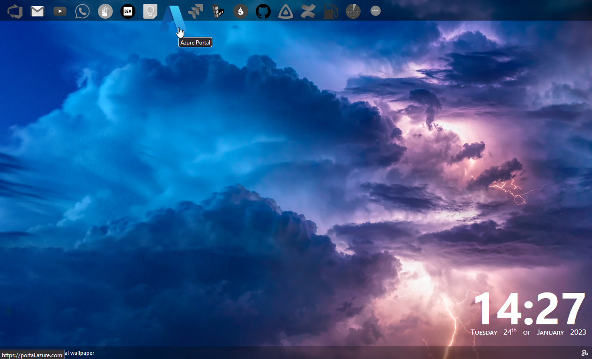

# Tabby
This is just another FireFox new tab extension because I couldn't find one that I wanted already available.

## Features 
- Stores all icons locally in local storage (so use smallish ones) so it cuts down on network requests for every new tab.
- Uses unsplash as the background.
- Add and remove icons for apps.
- Backgrounds urls are cached for an hour to avoid excess api usage.
- Settings menu allows you to manually refresh the background when ever you like.

## Installation
This extension can be installed directly in firefox (and will have auto updates) from the release page on this repo. However it's not signed (as yet) from Mozilla so it can only be installed in the [Developer Release](https://www.mozilla.org/en-US/firefox/developer/) or other experimental releases once you've disabled the signing check by going to `about:config`, change `xpinstall.signatures.required` to `false`.

To use the extension you'll need a free unsplash api key which can be obtained from the [Unsplash Dev Portal](https://unsplash.com/developers). You will be prompted for this when you first open the extension.

