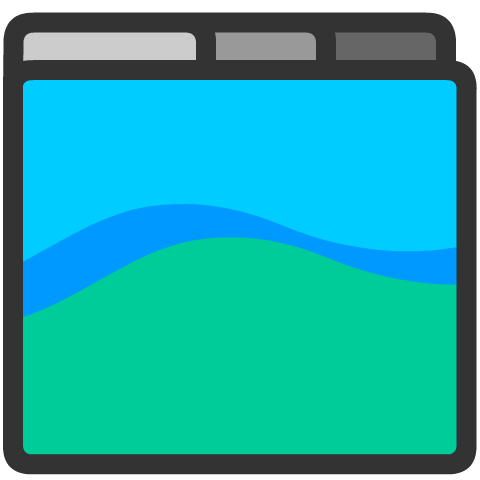
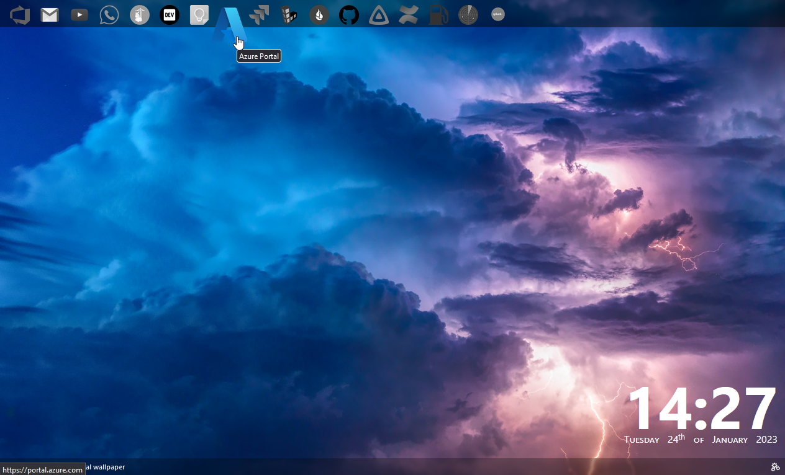
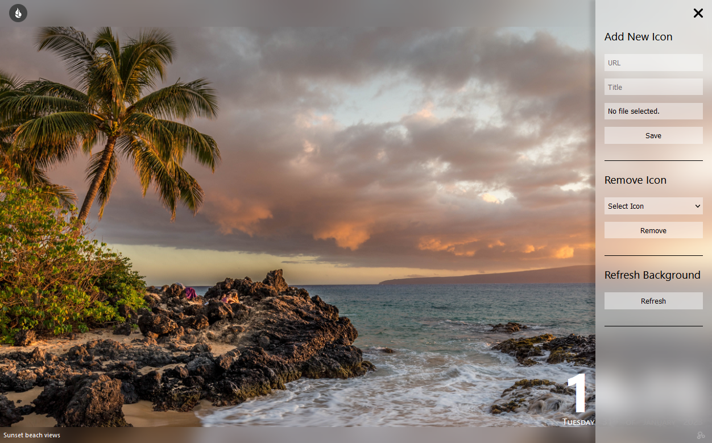

#  Tabby
Tabby is a customizable new-tab page for Firefox and Chrome, built because I couldn't find one that I wanted already available.

## Features 
- Stores uploaded shortcut icons locally in browser storage.
- Finds site favicons automatically when adding a shortcut; white favicon backdrops blend into the page and a local image can be uploaded instead.
- Uses configurable Unsplash search terms and color filters for optional landscape photo backgrounds, with photographer attribution.
- Uses a dark default background and a first-run welcome panel with a shortcut to Settings.
- Shows current weather in the top-right corner when a location is configured.
- Add and remove shortcuts for apps and websites.
- Reorder shortcuts by dragging them in the header or using the Move up/Move down controls in Settings.
- Background URLs are cached for an hour to avoid excess API usage.
- Settings let you configure backgrounds, manage shortcuts, and manually refresh the photo.
- Import and export icon lists.
- Optional Azure DevOps panel lists your open assigned work items with direct links and a filter for completed/done items.
- Supports both Chrome and Firefox.

## Installation
There are two release channels you can install this extension from which are described below.

### Sideloaded builds
__Firefox Developer Edition__: Download [tabby-firefox-dev.xpi](https://github.com/RobbieLD/tabby/releases/latest/download/tabby-firefox-dev.xpi). Unsigned add-ons can only be installed this way in Firefox Developer Edition or Nightly; regular Firefox releases require signed add-ons.

1. Open `about:config` and accept the warning.
2. Find `xpinstall.signatures.required` and set it to `false`. If it is not listed, add it as a Boolean with value `false`. This preference is saved in the current Firefox profile and persists across browser restarts.
3. Open `about:addons`, select the gear menu, choose **Install Add-on From File…**, and select the downloaded `.xpi`. Confirm the installation.

Install the XPI through Add-ons Manager for a persistent installation. Do not use `about:debugging` → **Load Temporary Add-on**; temporary add-ons are removed when Firefox closes. If you create a new Firefox profile, repeat the preference change there.

__Chrome__: Download the [latest Chromium release zip](https://github.com/RobbieLD/tabby/releases/latest/download/tabby-chromium-release.zip), extract it, enable Developer mode on the extensions page, and choose **Load unpacked**. Unpacked extensions do not update automatically.

### Stable
The stable Firefox release is available from the [Firefox Add-ons page](https://addons.mozilla.org/en-US/firefox/addon/tabby/). A Chrome Web Store listing is not available yet; use the Chromium release archive above.

Pushing a numeric `X.Y.Z` tag submits the Firefox release build and its reproducible source archive to AMO's **listed** channel when the repository has `FIREFOX_JWT_ISSUER` and `FIREFOX_JWT_SECRET` configured under **Settings → Secrets and variables → Actions**. Generate the API key (issuer) and secret from the [AMO API credentials page](https://addons.mozilla.org/en-US/developers/addon/api/key/); store the key as `FIREFOX_JWT_ISSUER` and the secret as `FIREFOX_JWT_SECRET`. Mozilla still reviews listed submissions; the workflow submits the update automatically but does not bypass review, so it appears on the public listing after approval. If the secrets are absent, the workflow warns and skips AMO submission while still creating the GitHub release.

## Usage
To use Unsplash backgrounds, add an API access key from the [Unsplash Dev Portal](https://unsplash.com/developers) in Settings. Backgrounds are optional; saving the key requests access to Unsplash. Configure the search terms and color filter in **Settings → Background** (defaults are `nature` and `black`; choose **Any color** to omit the color filter). These settings are sent to Unsplash when requesting a landscape photo; photographer attribution is displayed.

To show the Azure DevOps panel, enter your organization name (the part after `dev.azure.com/`) and a personal access token in Settings. Create a PAT with the **Work Items (Read)** scope and an expiry that suits you. The browser asks for Azure DevOps access only when you save a complete, enabled panel configuration. The PAT is stored in the extension's local browser storage and is sent only to Azure DevOps. The panel shows up to 100 of your most recently changed, open work items; use its **Hide completed and done** checkbox to include or exclude those states. Remove the PAT from Settings at any time to hide the panel, delete the saved token, and revoke access.

To show current weather, choose **Use browser location** in **Settings → Weather** and grant the browser's location permission. Tabby requests location only after you click the button; it does not track location in the background. Coordinates are saved in this browser and sent directly to [Open-Meteo](https://open-meteo.com/) for weather and [BigDataCloud](https://www.bigdatacloud.com/geocoding-apis/free-reverse-geocode-to-city-api) to find a nearby city or locality; these services also receive your network IP address. No API keys are required. Clear the location in Settings to delete the saved coordinates and revoke location/weather access. The widget refreshes weather every 15 minutes and links to both data providers for attribution.

Automatic shortcut icons use Google's S2 favicon service and send the site's origin to Google. If you prefer not to use the service, upload a local image when adding the shortcut; uploaded images remain in local browser storage.

## Development
The code is written in [Svelte](https://svelte.dev/). Use Node.js 20 or newer, clone the repository, and run `yarn install`. Start the live-reload preview with `yarn dev` and open [http://localhost:8080](http://localhost:8080); source and style edits rebuild and reload automatically.

For live local integrations, copy `.env.example` to `.env.local` and set `TABBY_AZURE_DEVOPS_ORGANIZATION`, `TABBY_AZURE_DEVOPS_PAT`, and/or `TABBY_UNSPLASH_ACCESS_KEY`. The Azure DevOps panel uses live data only when both organization and PAT are present; otherwise it shows labelled sample data. The Unsplash key loads real photos. Restart `yarn dev` after changing `.env.local`. It is Git-ignored. Dev credentials are injected into the local browser bundle, so use this only on your own machine and do not expose the dev server or share its bundle. `yarn build` ignores `.env.local` and injects empty dev settings. Build with `yarn build` or check TypeScript with `yarn typecheck`.

## Contributing
Contributions in the form of PRs are welcome. This started as a little project for me to make something I wanted but since I've gone to all that work I figured I'd put it on the Mozilla add-on hubs so other's could use it too. There's a lot of features around customisation which could be added but I haven't bothered with at the moment since it's how I want it, but I'll probably get to some of them in the future. 
