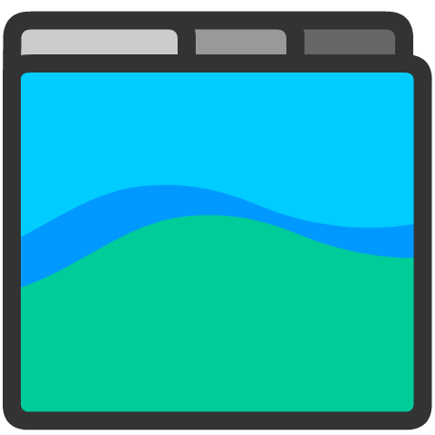
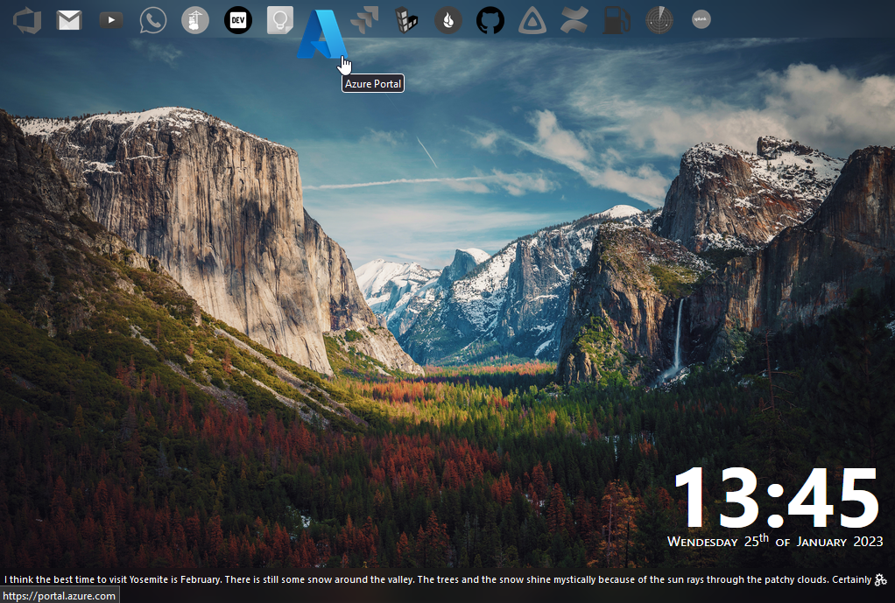
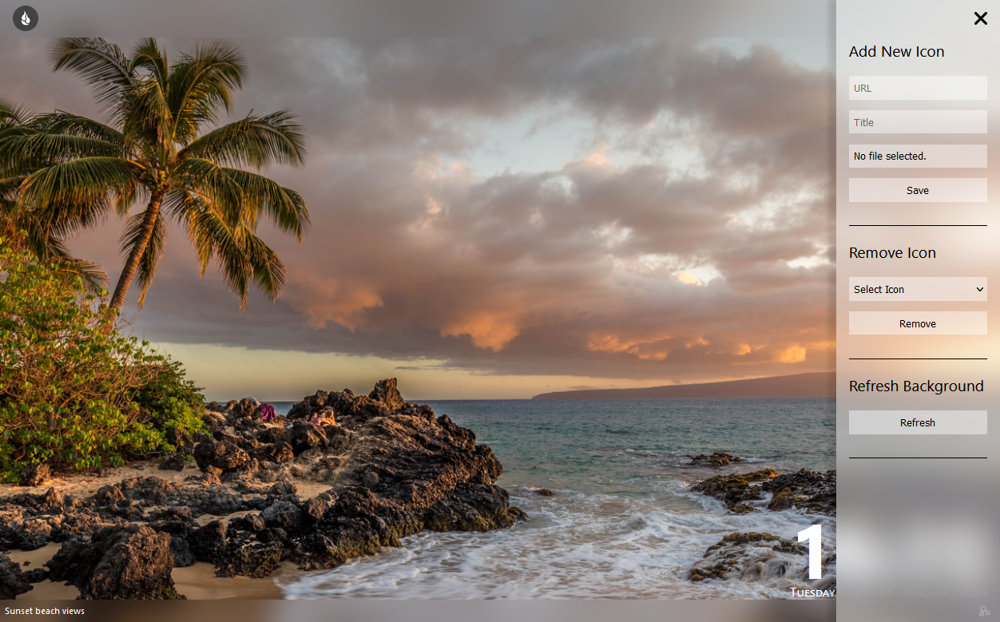

#  Tabby
This is just another FireFox new tab extension because I couldn't find one that I wanted already available.

## Features 
- Stores all icons locally in local storage (so use smallish ones) so it cuts down on network requests for every new tab.
- Uses unsplash as the background.
- Add and remove icons for apps.
- Backgrounds urls are cached for an hour to avoid excess api usage.
- Settings menu allows you to manually refresh the background when ever you like.
- Import and export icon lists.

## Installation
There are two release channels you can install this extension from which are described below.

### Develop
This extension can be installed directly in firefox (and will have auto updates) from the release page in this repo by downloading [tabby.xpi](https://github.com/RobbieLD/tabby/releases/latest/download/tabby.xpi). However it's not signed (as yet) from Mozilla so it can only be installed in the [Developer Release](https://www.mozilla.org/en-US/firefox/developer/) or other experimental releases once you've disabled the signing check by going to `about:config`, change `xpinstall.signatures.required` to `false`.

### Stable
Stable releases are available from the FireFox [add on page](https://addons.mozilla.org/en-US/firefox/addon/tabby/)

## Usage
To use the extension you'll need a free unsplash api key which can be obtained from the [Unsplash Dev Portal](https://unsplash.com/developers). You will be prompted for this when you first open the extension.

## Development
The code is written in [Svelte.js](https://svelte.dev/). To get started clone the repository and then run `yarn install` to install the required packages. You can start a development server with `yarn run dev` or package the extension with `yarn run build`.

## Contributing
Contributions in the form of PRs are welcome. This started as little project for me to make something I wanted but since I've gone to all that work I figured I'd put it on the Mozilla and Chrome add-on hubs so other's could use it too. There's a lot of features around customisation which could be added but I haven't bothered with at the moment since it's how I want it, but i'll probably get to some of them in the future. 

